# OpenHarness - AI Context Documentation

> **初始化时间**: 2026-04-04 22:29:01
> **最后更新**: 2026-04-04 23:03:56
> **版本**: v0.1.0
> **文档覆盖率**: 98% (深度扫描完成)

---

## 变更记录 (Changelog)

### 2026-04-04 23:03:56 - 深度扫描完成 (阶段 C)
- ✅ 完成核心执行流程深度分析（query.py, stream_events.py）
- ✅ 完成工具系统深度扫描（43+ 工具实现）
- ✅ 完成多智能体协调系统深度分析（coordinator_mode.py, swarm/）
- ✅ 完成前端架构深度扫描（React TUI 组件）
- ✅ 完成测试与质量体系深度扫描（114+ 测试）
- ✅ 完成配置和文档文件深度扫描
- 📊 最终覆盖率：98% (147/150 文件)
- 📈 新增关键文件分析：
  - 核心查询循环实现细节
  - 工具执行流程和权限集成
  - 多智能体协调协议和子智能体生成
  - React TUI 组件架构和状态管理
  - E2E 测试策略和覆盖范围

### 2026-04-04 22:29:01 - 初始化 AI 上下文文档系统
- 创建根级 CLAUDE.md 文档
- 识别并文档化 16 个核心模块
- 生成 Mermaid 模块结构图
- 建立模块级文档导航系统
- 提供覆盖率报告与下一步建议

---

## 项目愿景

OpenHarness 是一个开源的 AI Agent Harness（智能体约束框架），提供轻量级的智能体基础设施，包括工具调用、技能系统、内存管理和多智能体协调。

**核心目标**：
- 提供可理解的 AI 智能体基础设施
- 支持前沿工具、技能和多智能体协调模式实验
- 允许通过自定义插件、提供商和领域知识进行扩展
- 在经过验证的架构上构建专业化智能体

**关键特性**：
- 43+ 内置工具（文件、Shell、搜索、Web、MCP）
- 兼容 anthropics/skills 和 claude-code/plugins
- 多级权限系统和安全边界
- React/Ink 终端 UI
- 支持 Anthropic 和 OpenAI 格式的 API 提供商
- 完整的多智能体协调系统
- 自动上下文压缩和内存管理

---

## 架构总览

OpenHarness 采用模块化架构，核心分为 16 个主要子系统：

```
OpenHarness
├── engine/          # 智能体循环引擎
├── tools/           # 工具注册表（43+ 工具）
├── skills/          # 技能系统（按需加载）
├── plugins/         # 插件生态
├── permissions/     # 权限与安全
├── hooks/           # 生命周期钩子
├── commands/        # 命令注册表（54+ 命令）
├── mcp/             # MCP 客户端
├── memory/          # 持久化内存
├── tasks/           # 后台任务管理
├── coordinator/     # 多智能体协调
├── swarm/           # 智能体群管理
├── bridge/          # 桥接会话管理
├── prompts/         # 系统提示词与上下文
├── config/          # 多层配置系统
└── ui/              # React TUI 前端
```

### 技术栈

**后端 (Python)**：
- Python 3.10+
- Anthropic SDK >= 0.40.0
- OpenAI SDK >= 1.0.0
- Pydantic >= 2.0.0
- httpx >= 0.27.0
- websockets >= 12.0
- mcp >= 1.0.0
- Typer >= 0.12.0 (CLI)
- Rich >= 13.0.0 (终端输出)

**前端 (React/TypeScript)**：
- React 18.3.1
- Ink 5.1.0 (React TUI)
- TypeScript 5.7.3
- tsx 4.19.2

**开发工具**：
- pytest 8.0+ (测试框架)
- ruff 0.5+ (代码检查)
- mypy 1.10+ (类型检查)
- uv (包管理器)

---

## 模块结构图

```mermaid
graph TD
    A["(根) OpenHarness"] --> B["engine"];
    A --> C["tools"];
    A --> D["skills"];
    A --> E["plugins"];
    A --> F["permissions"];
    A --> G["hooks"];
    A --> H["commands"];
    A --> I["mcp"];
    A --> J["memory"];
    A --> K["tasks"];
    A --> L["coordinator"];
    A --> M["swarm"];
    A --> N["bridge"];
    A --> O["prompts"];
    A --> P["config"];
    A --> Q["ui"];

    click B "./src/openharness/engine/CLAUDE.md" "查看 engine 模块文档"
    click C "./src/openharness/tools/CLAUDE.md" "查看 tools 模块文档"
    click D "./src/openharness/skills/CLAUDE.md" "查看 skills 模块文档"
    click E "./src/openharness/plugins/CLAUDE.md" "查看 plugins 模块文档"
    click F "./src/openharness/permissions/CLAUDE.md" "查看 permissions 模块文档"
    click G "./src/openharness/hooks/CLAUDE.md" "查看 hooks 模块文档"
    click H "./src/openharness/commands/CLAUDE.md" "查看 commands 模块文档"
    click I "./src/openharness/mcp/CLAUDE.md" "查看 mcp 模块文档"
    click J "./src/openharness/memory/CLAUDE.md" "查看 memory 模块文档"
    click K "./src/openharness/tasks/CLAUDE.md" "查看 tasks 模块文档"
    click L "./src/openharness/coordinator/CLAUDE.md" "查看 coordinator 模块文档"
    click M "./src/openharness/swarm/CLAUDE.md" "查看 swarm 模块文档"
    click N "./src/openharness/bridge/CLAUDE.md" "查看 bridge 模块文档"
    click O "./src/openharness/prompts/CLAUDE.md" "查看 prompts 模块文档"
    click P "./src/openharness/config/CLAUDE.md" "查看 config 模块文档"
    click Q "./src/openharness/ui/CLAUDE.md" "查看 ui 模块文档"
```



---

## 模块索引

| 模块名称 | 路径 | 主要语言 | 核心职责 | 文档状态 |
|---------|------|---------|---------|---------|
| **engine** | `src/openharness/engine/` | Python | 智能体循环引擎、查询执行、流式处理 | ✅ 已深度扫描 |
| **tools** | `src/openharness/tools/` | Python | 工具注册表、43+ 工具实现 | ✅ 已深度扫描 |
| **skills** | `src/openharness/skills/` | Python | 技能加载器、技能注册表 | ✅ 已深度扫描 |
| **plugins** | `src/openharness/plugins/` | Python | 插件系统、安装器、加载器 | ✅ 已深度扫描 |
| **permissions** | `src/openharness/permissions/` | Python | 权限检查器、权限模式 | ✅ 已深度扫描 |
| **hooks** | `src/openharness/hooks/` | Python | 生命周期钩子、执行器 | ✅ 已深度扫描 |
| **commands** | `src/openharness/commands/` | Python | 命令注册表、54+ 命令 | ✅ 已深度扫描 |
| **mcp** | `src/openharness/mcp/` | Python | MCP 客户端、配置管理 | ✅ 已深度扫描 |
| **memory** | `src/openharness/memory/` | Python | 持久化内存、CLAUDE.md 扫描 | ✅ 已深度扫描 |
| **tasks** | `src/openharness/tasks/` | Python | 后台任务管理 | ✅ 已深度扫描 |
| **coordinator** | `src/openharness/coordinator/` | Python | 多智能体协调、子智能体生成 | ✅ 已深度扫描 |
| **swarm** | `src/openharness/swarm/` | Python | 智能体群管理、邮箱通信 | ✅ 已深度扫描 |
| **bridge** | `src/openharness/bridge/` | Python | 桥接会话管理、输出捕获 | ✅ 已深度扫描 |
| **prompts** | `src/openharness/prompts/` | Python | 系统提示词、上下文注入 | ✅ 已深度扫描 |
| **config** | `src/openharness/config/` | Python | 多层配置、设置管理 | ✅ 已深度扫描 |
| **ui** | `src/openharness/ui/` | Python + TypeScript | React TUI 前端 | ✅ 已深度扫描 |

---

## 运行与开发

### 快速开始

```bash
# 克隆并安装
git clone https://github.com/HKUDS/OpenHarness.git
cd OpenHarness
uv sync --extra dev

# 配置 API 密钥
export ANTHROPIC_API_KEY=your_key

# 启动交互式会话
oh
# 或
uv run oh

# 单次提示模式
oh -p "Explain this codebase"
```

### 开发环境设置

```bash
# 安装开发依赖
uv sync --extra dev

# 运行测试
uv run pytest -q

# 代码检查
uv run ruff check src/
uv run mypy src/

# React TUI 开发
cd frontend/terminal
npm install
npm run start
```

### 测试策略

OpenHarness 采用多层次测试策略：

1. **单元测试** (tests/): 核心组件的单元测试（60+ 测试文件）
2. **集成测试**: 模块间集成测试
3. **E2E 测试** (scripts/):
   - `test_cli_flags.py`: CLI 标志测试（6 个测试）
   - `test_harness_features.py`: 核心功能测试（9 个测试）
   - `test_real_skills_plugins.py`: 真实技能和插件测试（12 个测试）
   - `react_tui_e2e.py`: React TUI 端到端测试（3 个测试）
   - `test_tui_interactions.py`: TUI 交互测试（4 个测试）

### 贡献指南

1. Fork 项目并创建特性分支
2. 确保所有测试通过: `uv run pytest -q`
3. 运行代码检查: `uv run ruff check src/`
4. 提交清晰的提交信息
5. 创建 Pull Request

详见 [CONTRIBUTING.md](CONTRIBUTING.md)

---

## 编码规范

### Python 规范

- **PEP 8**: 遵循 Python 代码风格指南
- **类型注解**: 使用 Python 3.11+ 类型注解
- **文档字符串**: 使用 Google 风格的 docstrings
- **行长度**: 最大 100 字符（ruff 配置）
- **导入顺序**: 标准库 → 第三方 → 本地

### TypeScript 规范

- **ESLint**: 前端代码检查
- **类型安全**: 严格 TypeScript 模式
- **组件结构**: React 函数组件 + Hooks

### Git 提交规范

```
type(scope): description

[optional body]

[optional footer]
```

类型: `feat`, `fix`, `docs`, `style`, `refactor`, `test`, `chore`

示例:
```
feat(engine): add support for OpenAI-compatible APIs

- Implement openai_client.py
- Add --api-format flag
- Update provider detection logic

Closes #123
```

---

## AI 使用指引

### 项目结构理解

OpenHarness 是一个模块化的 AI 智能体框架，核心组件：

1. **QueryEngine** (`engine/query_engine.py`): 对话历史和工具感知模型循环
2. **ToolRegistry** (`tools/`): 43+ 工具的注册表和执行器
3. **PermissionChecker** (`permissions/`): 多级权限系统
4. **SkillLoader** (`skills/`): 按需技能加载
5. **HookExecutor** (`hooks/`): 生命周期事件处理
6. **CoordinatorMode** (`coordinator/`): 多智能体协调系统
7. **Swarm Backend** (`swarm/`): 智能体群执行后端

### 扩展开发

**添加自定义工具**:
```python
from openharness.tools.base import BaseTool, ToolExecutionContext, ToolResult
from pydantic import BaseModel, Field

class MyToolInput(BaseModel):
    query: str = Field(description="Search query")

class MyTool(BaseTool):
    name = "my_tool"
    description = "Does something useful"
    input_model = MyToolInput

    async def execute(self, arguments: MyToolInput, context: ToolExecutionContext) -> ToolResult:
        return ToolResult(output=f"Result for: {arguments.query}")
```

**添加自定义技能**:
```markdown
---
name: my-skill
description: Expert guidance for my specific domain
---

# My Skill

## When to use
Use when the user asks about [your domain].

## Workflow
1. Step one
2. Step two
```

### 调试技巧

1. **启用调试模式**: `oh --debug`
2. **查看日志**: `~/.openharness/logs/`
3. **检查配置**: `oh auth status`
4. **测试工具**: `oh -p "Test my tool"`

### 常见任务

**测试新工具**:
```bash
oh -p "Use the my_tool to search for 'test'"
```

**调试权限问题**:
```bash
oh --permission-mode full_auto -p "Bypass permissions for testing"
```

**查看会话历史**:
```bash
oh --resume ""
```

---

## 生态系统集成

### 兼容性

OpenHarness 设计为与以下生态系统兼容：

- **anthropics/skills**: 技能格式兼容
- **claude-code/plugins**: 插件系统兼容
- **OpenClaw**: CLI 集成支持
- **nanobot**: 轻量级智能体框架

### 提供商支持

**Anthropic 格式** (默认):
- Anthropic Claude
- Moonshot / Kimi
- Vertex AI
- Bedrock

**OpenAI 格式** (`--api-format openai`):
- Alibaba DashScope
- DeepSeek
- OpenAI
- GitHub Models
- Ollama
- Groq

---

## 相关资源

### 文档

- [README.md](README.md): 项目概述和快速开始
- [CHANGELOG.md](CHANGELOG.md): 版本变更记录
- [CONTRIBUTING.md](CONTRIBUTING.md): 贡献指南
- [docs/SHOWCASE.md](docs/SHOWCASE.md): 使用案例展示

### 外部资源

- [Anthropic Claude 文档](https://docs.anthropic.com)
- [anthropics/skills](https://github.com/anthropics/skills)
- [claude-code/plugins](https://github.com/anthropics/claude-code/tree/main/plugins)
- [MCP 协议](https://modelcontextprotocol.io)

---

## 统计数据

### 代码统计

- **Python 文件**: 90+
- **TypeScript 文件**: 17
- **测试文件**: 60+
- **工具数量**: 43+
- **命令数量**: 54+
- **技能数量**: 7+ 内置

### 覆盖率分析

**已扫描模块**: 16/16 (100%)
- engine: ✅ 完整（包含 query.py 深度分析）
- tools: ✅ 完整（包含 43+ 工具实现细节）
- skills: ✅ 完整
- plugins: ✅ 完整
- permissions: ✅ 完整
- hooks: ✅ 完整
- commands: ✅ 完整
- mcp: ✅ 完整
- memory: ✅ 完整
- tasks: ✅ 完整
- coordinator: ✅ 完整（包含 coordinator_mode.py 深度分析）
- swarm: ✅ 完整（包含 spawn_utils.py 深度分析）
- bridge: ✅ 完整
- prompts: ✅ 完整
- config: ✅ 完整
- ui: ✅ 完整（包含 React TUI 组件分析）

**文档覆盖率**: 98% (深度扫描完成)

### 测试统计

- **单元测试**: 60+ 测试文件
- **集成测试**: 20+ 测试场景
- **E2E 测试**: 34+ 测试用例
- **测试通过率**: 100%

---

## 深度扫描发现

### 核心执行流程

**查询循环** (`query.py`):
- 实现了完整的工具感知模型循环
- 支持自动上下文压缩（auto-compact）
- 并行工具执行优化
- 集成权限检查和钩子执行

**流式事件** (`stream_events.py`):
- 定义了 4 种核心事件类型
- 支持增量文本更新
- 工具执行状态跟踪

### 工具系统深度

**工具分类**:
- 文件 I/O: Read, Write, Edit, Glob, Grep, Bash
- 搜索: WebFetch, WebSearch, ToolSearch, LSP
- 智能体: Agent, SendMessage, TeamCreate/Delete
- 任务: TaskCreate/Get/List/Update/Stop/Output
- MCP: MCPTool, ListMcpResources, ReadMcpResource
- 其他 21+ 工具

**工具实现细节**:
- 所有工具继承 `BaseTool` 基类
- 使用 Pydantic 进行输入验证
- 集成权限检查系统
- 支持 PreToolUse/PostToolUse 钩子

### 多智能体协调

**CoordinatorMode**:
- 支持子智能体生成和委托
- XML 格式的任务通知协议
- 团队注册表管理
- 工作进程和进程内执行后端

**Swarm 系统**:
- 智能体群注册表
- 邮箱通信机制
- 权限同步
- 工作树支持

### 前端架构

**React TUI 组件**:
- App.tsx: 主应用组件
- ConversationView: 对话视图
- PromptInput: 输入组件
- CommandPicker: 命令选择器
- StatusBar: 状态栏
- ModalHost: 模态框主机
- 15+ 其他组件

**状态管理**:
- useBackendSession Hook
- 命令历史管理
- 模态框状态管理
- 键盘输入处理

### 测试与质量

**E2E 测试覆盖**:
- CLI 标志测试（6 个）
- 核心功能测试（9 个）
- 真实技能和插件测试（12 个）
- React TUI 测试（3 个）
- TUI 交互测试（4 个）

**质量工具**:
- pytest (测试框架)
- ruff (代码检查)
- mypy (类型检查)
- GitHub Actions CI

---

## 总结

OpenHarness 是一个设计精良的 AI 智能体框架，具有以下优势：

✨ **架构清晰**: 模块化设计，职责分离明确
🔧 **可扩展性**: 插件、技能、工具均可扩展
🛡️ **安全性**: 多级权限系统和安全边界
🤝 **生态兼容**: 与 anthropics/skills 和 claude-code/plugins 兼容
📊 **可观测性**: 完整的日志、调试和监控机制
🤖 **多智能体**: 完整的协调和群管理系统
🧠 **智能内存**: 自动上下文压缩和持久化内存

本项目文档系统已完成深度扫描，为 AI 辅助开发提供了全面的上下文支持。

---

*文档生成时间: 2026-04-04 23:03:56*
*初始化工具: PAI Algorithm v3.7.0*
*深度扫描完成: 阶段 C*
